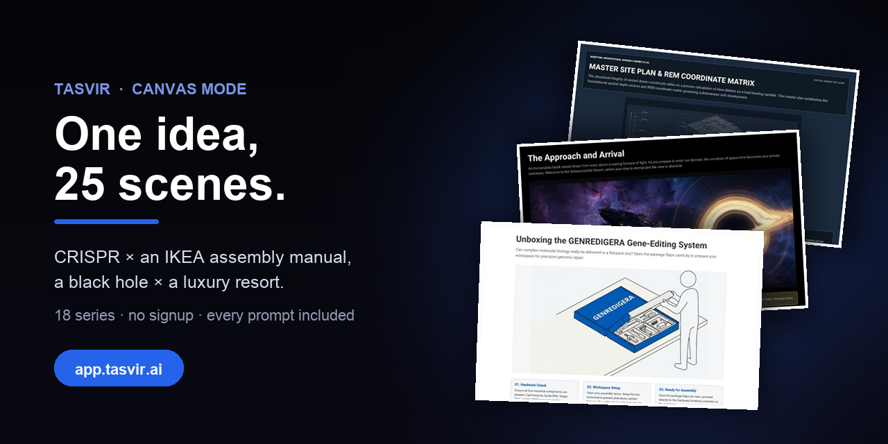

<div align="center">



# Canvas Mode — One Idea, 25 Scenes

### Tell a topic in a format nobody expects. The AI plans it, writes it and draws every scene.

[](https://app.tasvir.ai?src=github&utm_source=github&utm_medium=readme&utm_campaign=canvas-en&utm_content=top)
[](https://www.youtube.com/watch?v=tZgCnnuzCYA)
[](https://tasvir.ai/features/)

</div>

CRISPR as an IKEA assembly manual. A black hole as a luxury resort where you can check in but never check out. Inception as an architecture magazine. 18 series, each made from **a single prompt**: the AI drew up the plan, wrote the 25 scenes and illustrated every one of them.

## What canvas mode is

Tasvir makes two kinds of page. A **document** is fixed, printable paper — A4, A3 or slides — with text measured and paginated to fit. A **canvas** is a free scene 1440 pixels wide that grows to fit what is on it. With no paper to respect, a page can be a poster, a film still, a magazine cover or a collectible card.

Every series here was made in canvas mode: **25 scenes, each a page that stands on its own**, all in the same visual language.

## Six to start with

Click a picture: the series opens in your browser, no account needed.

<table>
  <tr>
    <td align="center" width="33%"><a href="https://app.tasvir.ai/c/772cfebdf5740204d133410dd29be7f26416306be2a6777538ae47dcf6477515/1"></a><br/><strong>CRISPR</strong><br/><sub>× IKEA assembly manual</sub></td>
    <td align="center" width="33%"><a href="https://app.tasvir.ai/c/4d513f80ad59ca71f072f2da90f615970c386cabf9165d44a6d4cacccdfbffc1/1"></a><br/><strong>A black hole</strong><br/><sub>× Schwarzschild Resort brochure</sub></td>
    <td align="center" width="33%"><a href="https://app.tasvir.ai/c/8ba4632010d3c54b2125260cf694ddb4f1e61125f35df924382e58579bf00a03/1"></a><br/><strong>Inception</strong><br/><sub>× architecture magazine</sub></td>
  </tr>
  <tr>
    <td align="center" width="33%"><a href="https://app.tasvir.ai/c/0522e440e3ad6896e8f6e3b66813cb1b76d1a91810d53c54ef585308b9939410/1"></a><br/><strong>The Black Death, 1347</strong><br/><sub>× daily newspaper</sub></td>
    <td align="center" width="33%"><a href="https://app.tasvir.ai/c/4f11a7c4fac82fd90a0eeca1d2d47185f4e480abafc4f2d0a9ff64b066459671/1"></a><br/><strong>Transformer attention</strong><br/><sub>× the Ottoman Imperial Council</sub></td>
    <td align="center" width="33%"><a href="https://app.tasvir.ai/c/7897087f83e98cff9564c1d7de8b2c65fa3aa4bd25fe4f3c9c1d2cde76783640/1"></a><br/><strong>Quantum entanglement</strong><br/><sub>× long-distance rom-com</sub></td>
  </tr>
</table>

## The formula: topic × unexpected format

The same idea is behind all of them. Take a topic you know and put it inside a format it has no business being in:

```
[topic]            × [format]
CRISPR             × IKEA assembly manual
The periodic table × football transfer window
The human eye      × camera user manual
```

The format gives the story its skeleton: the headings of a case study, the HP on a trading card, the floor plans in a brochure. The topic stays real; the dates, numbers and names are right.

**[Try your own →](https://app.tasvir.ai?src=github&utm_source=github&utm_medium=readme&utm_campaign=canvas-en&utm_content=formula)** — every new account gets free credits, enough for a first series; no credit card.

---

## Every series

Five were written in English from the start (Quantum, CRISPR, Black hole, Inception, Tarantino). The rest were first made in Turkish and translated page by page, with the layout and drawings untouched; their prompts below are translations of the originals. Every prompt ends with the same sentence, which is what makes it a 25-scene canvas series:

> Output format: a visual canvas series of at least 25 scenes; every page is a scene complete on its own. Not an A4 document, magazine or slide deck. If there are fewer listed items than 25 scenes, spread each one across several scenes.

### Science

| Topic | Told as | |
|---|---|---|
| CRISPR | IKEA assembly manual | [Open](https://app.tasvir.ai/c/772cfebdf5740204d133410dd29be7f26416306be2a6777538ae47dcf6477515/1) |
| A black hole | Schwarzschild Resort brochure | [Open](https://app.tasvir.ai/c/4d513f80ad59ca71f072f2da90f615970c386cabf9165d44a6d4cacccdfbffc1/1) |
| Quantum entanglement | long-distance rom-com | [Open](https://app.tasvir.ai/c/7897087f83e98cff9564c1d7de8b2c65fa3aa4bd25fe4f3c9c1d2cde76783640/1) |
| The periodic table | football transfer window | [Open](https://app.tasvir.ai/c/a1f4557c73d407a0c65cd0a0b8c1fe4548c67e94a6c1710369e0729f943723dc/1) |
| Derivatives | heist movie | [Open](https://app.tasvir.ai/c/b5bf7616b5fb49473bbbbd5a9395ca7ee1c39853c8538db81952029ff0c8d532/1) |
| The Moon and the Earth | marriage counselling file | [Open](https://app.tasvir.ai/c/0302fe167de544527086a18e2e52e5b33eaff0cc52c6a5d32c3b1262b3f47943/1) |
| The human eye | camera user manual | [Open](https://app.tasvir.ai/c/b22b14ab3e6053cc29c7406377fa67909f8d464930de95dff4d066d55ba1ea3f/1) |

<details>
<summary>The 7 prompts in this section</summary>

```
Explain CRISPR-Cas9 gene editing as an IKEA assembly manual: product name
GENREDIGERA, parts list (Cas9, guide RNA, target DNA, PAM sequence), step-by-step
assembly, 'if you cut the wrong place' warning boxes, an ethics warning label.
Isometric black line drawings, IKEA blue-yellow accents, scientifically accurate.

Tell a black hole as a luxury hotel brochure: Schwarzschild Resort, check-in but no
check-out, suites with an event-horizon view, a spaghettification spa package, a
thousand-years-in-a-day time-dilation package, Hawking radiation as the exit door.
Real astrophysics and formulas, dark theme, gold accents, hotel render visuals.

Tell quantum entanglement as a romantic comedy about two photons in a long-distance
relationship. The photons are called Alice and Bob and their names never change.
Every page is a screenplay scene with a real physics box beside it: superposition,
measurement, the Bell inequality as an 'are we really connected?' test, Einstein's
spooky-action-at-a-distance objection, the 2022 Nobel experiments. Warm, funny, with
a touching ending.

Tell the periodic table as a football transfer window: noble gases are loyal players
who never change clubs, alkali metals are free agents who join any team, halogens
are aggressive strikers, the transfer fee is ionisation energy, electronegativity is
bargaining power. Transfer cards, real chemistry, a high-school reader, funny.

Tell derivatives as a heist movie: the crew is the limit, the chain rule, the
product rule and the quotient rule; the target is the instantaneous-rate vault;
every planning scene has a real worked example and a whiteboard drawing; the big
score at the end is a maximum-minimum problem. A final-year high-school reader,
exciting and memorable.

Tell the 4.5-billion-year relationship between the Moon and the Earth as a marriage
counselling file: how they met (the Theia impact), tidal locking and why the Moon
always shows the same face, the Moon drifting 3.8 cm further away every year, days
getting longer. Counsellor notes, session records, sky visuals, a little sad and
funny.

Explain the human eye as a professional camera's user manual: the sensor is the
retina, ISO is the rods and cones, the aperture is the iris, autofocus is the lens
muscles, the blind spot is a known bug, glasses are a software update. Technical
drawings, clean manual design, scientifically accurate.
```

</details>

### Film

| Topic | Told as | |
|---|---|---|
| Inception | architecture magazine | [Open](https://app.tasvir.ai/c/8ba4632010d3c54b2125260cf694ddb4f1e61125f35df924382e58579bf00a03/1) |
| Tarantino's films | metro map | [Open](https://app.tasvir.ai/c/b7954a2814b923c369e6b3d20b391e61375aa95f5454595fd9433353a0cc6cf9/1) |
| The Godfather | MBA case study | [Open](https://app.tasvir.ai/c/b41b4aa3c08b95593d937dc01544183987c4cd1163842be06af183b6653f9c56/1) |

<details>
<summary>The 3 prompts in this section</summary>

```
Tell Inception as an architecture magazine: every dream level is a building project,
floor plans, the time multiplier as structural load, a Penrose staircase detail
drawing, an interview with the architect Ariadne, a project file for the limbo city.
Concrete grey and cold blue palette, editorial typography.

Tell Quentin Tarantino's films as a metro map: every film is a line, characters are
stations, shared-universe links are interchanges (the Vega brothers, Red Apple
cigarettes, Big Kahuna Burger). Legend, line colours, short station notes.

Tell The Godfather as an MBA case study: the Corleone family business succession
plan, the leadership handover from Vito to Michael, risk management, the
offer-you-can't-refuse negotiation model, an org chart, discussion questions.
Business case format, sepia tones.
```

</details>

### Technology

| Topic | Told as | |
|---|---|---|
| Transformer attention | the Ottoman Imperial Council | [Open](https://app.tasvir.ai/c/4f11a7c4fac82fd90a0eeca1d2d47185f4e480abafc4f2d0a9ff64b066459671/1) |
| The history of the internet | Silk Road caravan map | [Open](https://app.tasvir.ai/c/66e110c767b6de8b92daec77233ae8ccaacb03d26e1631bb2d744902ed1bf214/1) |
| Inside a smartphone | city atlas | [Open](https://app.tasvir.ai/c/5206c7a7a3b17dc8375fbadc20cee2db0a3a67af60b939fd4c6221a4db81cb15/1) |

<details>
<summary>The 3 prompts in this section</summary>

```
Explain the Transformer architecture and the attention mechanism as the Ottoman
Imperial Council: tokens are petitions brought to the council, query-key-value is
how much weight each vizier gives each petition, multi-head attention is different
viziers, layers are successive council meetings, softmax is the grand vizier's
decision. Real maths formulas in separate boxes, council miniature visuals. For
developers and curious readers.

Tell the history of the internet as a Silk Road caravan map: ARPANET is the first
caravanserai, TCP/IP is the customs rules, DNS is the road signs, submarine fibre
cables are the sea routes, data centres are the port cities, key years are
milestones. Old map aesthetic, legend and route notes.

Explain the inside of a smartphone as an isometric city atlas: the processor is
downtown, RAM is the warehouse district, storage is the archive, the battery is the
power plant, antennas are the communication towers, the camera sensor is the
observatory; street names are real component names. Legend and short notes.
```

</details>

### History and places

| Topic | Told as | |
|---|---|---|
| The Black Death, 1347 | daily newspaper | [Open](https://app.tasvir.ai/c/0522e440e3ad6896e8f6e3b66813cb1b76d1a91810d53c54ef585308b9939410/1) |
| The world's strangest borders | travel noir magazine | [Open](https://app.tasvir.ai/c/4a897f5a51ff68ecc4eabd0aa4e491ac974750c03ade0d13505f7e2e0e097b6c/1) |
| Cappadocia | Mars colony real-estate brochure | [Open](https://app.tasvir.ai/c/c730ad76f80821596bd8d3d7567b8480061d94f63497fb08573e63479dfa3e01/1) |

<details>
<summary>The 3 prompts in this section</summary>

```
Tell the 1347-1351 Black Death as the issues of a newspaper published over the
years: each page is one period's front page, a spread map from the siege of Caffa
into Europe, death toll charts, period adverts, a news story about the plague doctor
mask. Old newspaper design, sepia with red accents, tense and factual.

Tell the world's strangest borders (Baarle-Hertog and Baarle-Nassau, unclaimed Bir
Tawil, the date line between Big and Little Diomede, Pheasant Island changing hands
between Spain and France every six months, Point Roberts) as a travel noir magazine.
Every border is a story, black-and-white photo aesthetic, dry and clever humour.

Tell Cappadocia as a luxury real-estate brochure sold to a Mars colony:
fairy-chimney apartments, Derinkuyu Residence underground city floor plans and
square-metre tables, the Göreme open-air museum as the social facility, balloon
rides as transport, the thermal insulation of volcanic tuff as a technical spec.
Real geology and history, orange-pink sunrise palette, futuristic render visuals.
```

</details>

### Kids

| Topic | Told as | |
|---|---|---|
| Dinosaurs | a school class | [Open](https://app.tasvir.ai/c/1f0c6bede218252e053a43e35f8bbba804807a85bd25350ffc9292200c0e6dab/1) |
| Cotton the cat | space mission diary | [Open](https://app.tasvir.ai/c/501bf899209fa5102fb949627007f37b536cf49018f9e33838a0871e00f4bb3d/1) |

<details>
<summary>The 2 prompts in this section</summary>

```
For 8-10 year olds, what if dinosaurs were a school class: a class list, each
dinosaur's report card (real height, weight, period and diet on the card), teacher
notes, a playground fight between T-Rex and Triceratops, a class photo. Funny,
colourful illustrations, real palaeontology.

A picture book for 6-year-old Zeynep: the Solar System space mission diary of her
white fluffy cat Cotton. The cat is called Cotton, always white and fluffy with an
orange collar, and this never changes. Every page is a planet, with Cotton's note
from the adventure and a real planet fact box at the bottom. Pastel illustrations,
short sentences, warm and curious.
```

</details>

---

## What Tasvir can draw

On a canvas or in a document, every scene gets the visual its idea needs:

- **25 chart types** — bar, line, radar, heatmap, waterfall, candlestick and more
- **17 diagram types** — kanban, mindmap, timeline, gantt, sankey, flowchart and more
- **Geometry and maths** — angles, arcs, coordinate planes, TikZ drawings, LaTeX formulas
- **AI illustrations, syntax-highlighted code, tables and icons**

The full list: **[tasvir.ai/features](https://tasvir.ai/features/)**

## More showcases

- **[Tasvir-Canvas-Mode-TR](https://github.com/Tasvir-app/Tasvir-Canvas-Mode-TR)** — 45 canvas series in Turkish: Gallipoli as a Nolan storyboard, Turkish provinces as Pokémon cards.
- **[Tasvir](https://github.com/Tasvir-app/Tasvir)** — study guides, reports, magazines and kids' books made with Tasvir.

---

<div align="center">

### Which topic would you tell in which format?

[](https://app.tasvir.ai?src=github&utm_source=github&utm_medium=readme&utm_campaign=canvas-en&utm_content=bottom)

If this was useful, a star helps other people find it.

Questions or feedback: [support@tasvir.ai](mailto:support@tasvir.ai)

</div>
